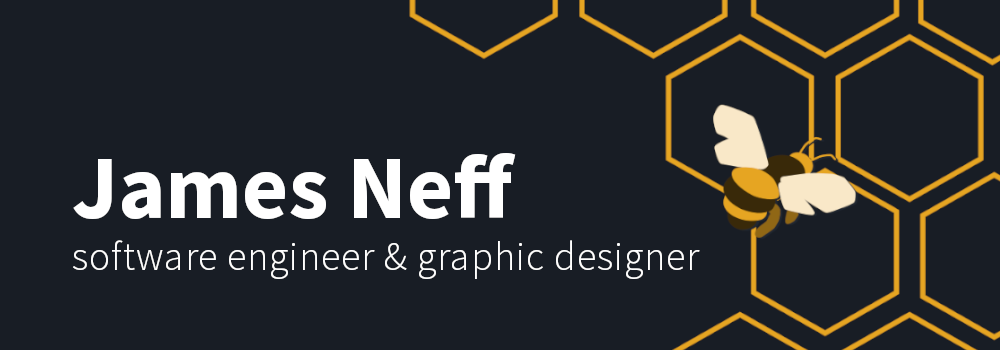

# 👋Hello! I'm James

I'm a software engineer with 10 years of experience across diverse areas of print and web design. I love blending the art of design with the technicality of programming to create captivating user experiences. As a natural problem solver, I enjoy learning new ways to bring ideas to life while maintaining accessible and clean code. I want to continue working with diverse, passionate teams to improve the world we live in.

- 🔭 I’m currently working on [Shower Thoughts](https://github.com/NeffCodes/shower_thoughts)

- 📚 I’m currently learning **Authentication with the MERN stack**

- 🖌️ All of my projects are available at [https://jamesneff.com](https://jamesneff.com)

- 💬 Ask me about **HTML, CSS, Javascript, React, MERN Stack, or Graphic Design**

- 📫 How to reach me **contact@jamesneff.com**

- 🐝 Fun fact: **I find bees fascinating**

---

<h2 align="center">Connect with me:</h2>

<h2 align="center">Languages and Tools:</h2>

 
   
   
   
   
   
   
  
  
   

   
  
  
  
  
  
  
  
    

---
<table width="100%">
  <tbody>    
    <tr width="100%">
      <td width="50%" v-align="top">
        <h3 align="center">Glimpse into the Universe</h3>
         
        
        <section align="center">
          
          
        </section>
        
A responsive web app which allows the user to infinitely scroll through NASA's Astronomy Photo of the Day archive. Supports both videos and photos.

         
        
<strong>HTML5 | CSS3 | Javascript</strong>

      </td>
      <td width="50%" v-align="top">
        <h3 align="center">Shower Thoughts</h3>
         
        
        <section align="center">
          
          
        </section>
        
A full-stack web app where users can log in to their profile, find their list of thoughts, add new thoughts, and edit/delete thoughts with a simple user interface.

         
        
<strong>MongoDB | Express | Handlebars | Node.js | Google OAuth</strong>

      </td>  
    </tr>
    <tr width="100%">
      <td width="50%" v-align="top">
        <h3 align="center">jamesneff.com</h3>
         
        
        <section align="center">
          
          
        </section>
        
Personal portfolio site including links to my projects as well as my technical skills and ways to get in contact with me.

         
        
<strong>Figma | Next.js | Framer Motion</strong>

      </td>
      <td width="50%" v-align="top">
        <h3 align="center">Andriana's Pizza Toppings</h3>
         
        
        <section align="center">
          
          
        </section>
        
A simple full-stack CRUD app to see what toppings truly belong on a pizza. Users are able to vote on, change their vote, and add what toppings they like.

         
        
<strong>HTML5 | CSS3 | Express | MongoDB | EJS | Node.js</strong>

      </td>
      </tr>
  </tbody>
</table>

---

<h2 align="center">My stats</h2>

